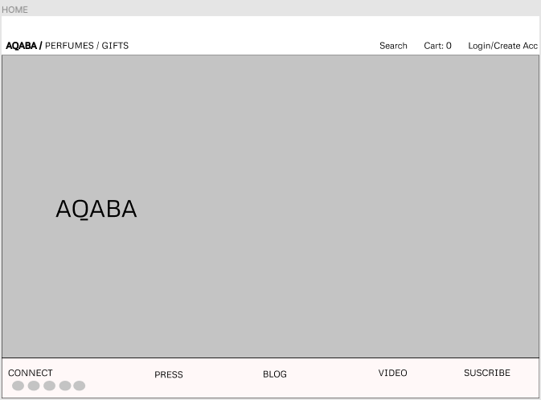
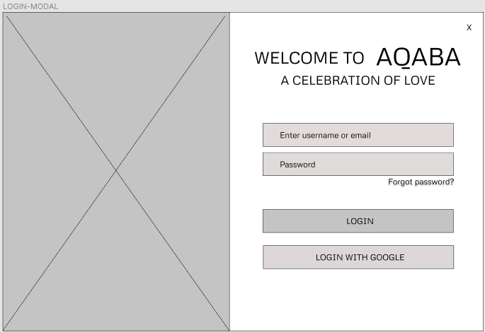
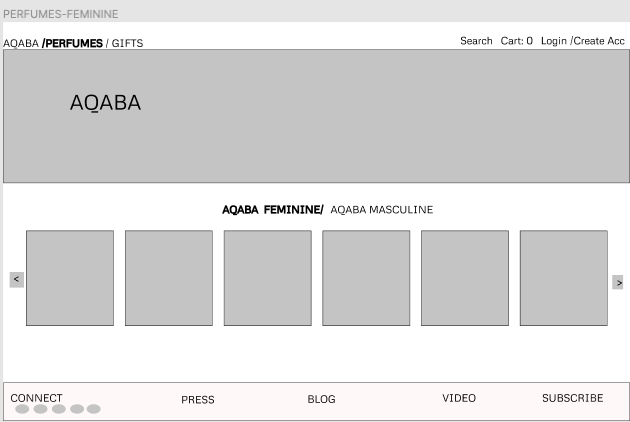
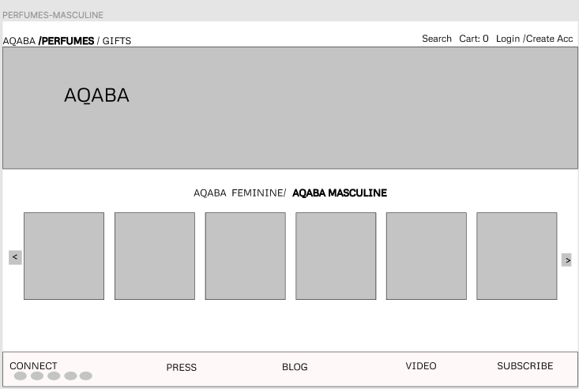
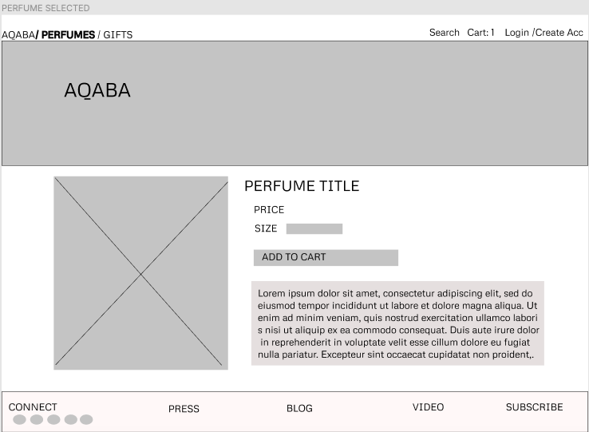
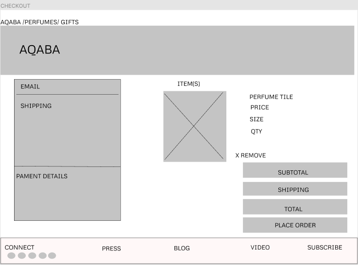

# Aqaba: A complete makeover of the website for Aqaba perfumes

### I took a site that offers a unique product and decided to completely redo it. Aqaba by Miriam Mirani is a perfume site that also offers other products related to body care and home decor. 

### Author: Riva Davidowski

### Tools Used:

- React
- react-spring-modal
- react-responsive-carousel
- react-router-dom
- Material-UI
- react-google-login
- Google Developers Console
- google-auth-library
- My API server for database API and server-side verification
- Axios
- Figma (for wireframes)

### How to use Aqaba: You can clone the repo and run `npm i` on the CLI to install all dependencies used. From there, explore the site! Add some items to your cart, switch back and forth between feminine and masculine scents, or check out gifts and bath and body products.

### Demo
 This site is still in progress.
 [Aqaba Demo]('./../public/assets/aqaba-demo.mov)

### Wireframes:

